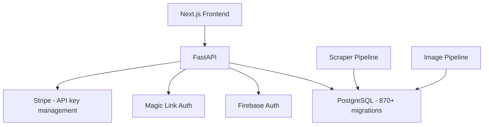

# shelf_analytics_api

FastAPI backend for the Loupe shelf analytics platform. Serves product data, matching results, pricing analytics, and brand dashboards to the frontend application.

Part of the [Loupe](https://getloupe.com) shelf analytics platform.

## Architecture

## What it does

The API serves as the middleware between the data pipeline and the client-facing dashboard. Key functionality:

- **Product analytics** -- Brand product catalog, retailer product listings, price history, availability tracking
- **Matching results** -- Product match confidence scores, match review workflows, auto-match vs. manual review
- **Content scoring** -- How well retailers represent brand products (images, descriptions, specifications)
- **Dual authentication** -- Firebase token auth for frontend users, Magic Link/OTP for passwordless onboarding
- **API key management** -- Stripe-inspired API keys for programmatic access

## Key technical decisions

- **Stripe-inspired canonical log lines** -- every request logs a single structured line with request metadata, response status, user context, and timing. Makes debugging production issues straightforward
- **Dual auth system** -- Firebase for existing users, Magic Link for new user onboarding without passwords
- **Async FastAPI** -- non-blocking I/O for database queries and external service calls
- **Layered architecture** -- routers, CRUD operations, and database models cleanly separated

## Stack

Python, FastAPI, PostgreSQL, Firebase Admin SDK, Magic SDK, JWT, Cloud Run, Docker
